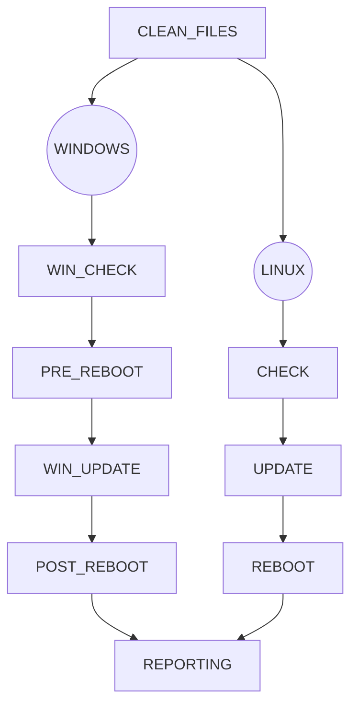

# Run Linux and Windows updates with Ansible

## Requirements
- Ansible 2.9
- Complete inventory file with hosts windows (keep windows and linux groups).
- Configure hosts access : SSH / WINRM with privileged accounts (see vars in groups_vars folder)
- Manage secrets and protect all sensitive data with ansible vault (if necessary)

&nbsp;

## Workflow


&nbsp;
  
## Setup
```bash
ansible-playbook main.yml -i inventory
```

&nbsp;
  
### Reporting

  
