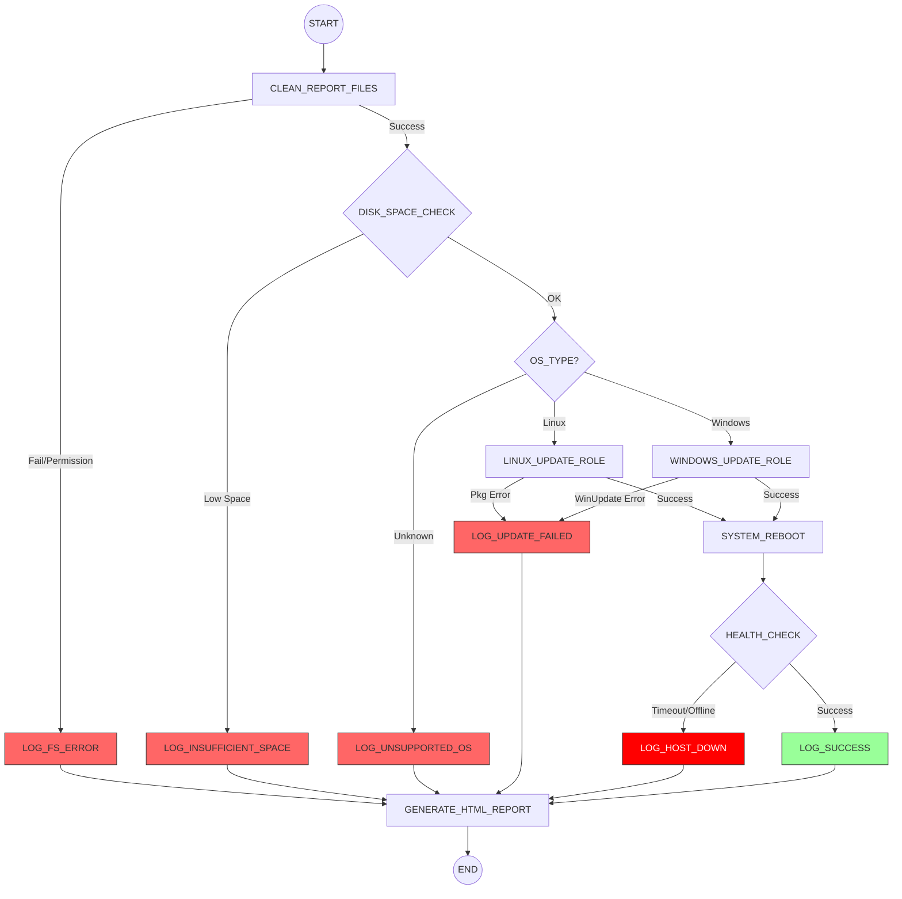

# Run Linux and Windows updates with Ansible

## Requirements
- Ansible 2.9

&nbsp;

## Workflow

```mermaid
graph TD;
    %% Phase Initialisation
    START((START)) --> CLEAN[CLEAN_REPORT_FILES];
    CLEAN -- Success --> SPACE{DISK_SPACE_CHECK};
    CLEAN -- Fail/Permission --> ERR_INIT[LOG_FS_ERROR];

    %% Phase Pré-requis
    SPACE -- OK --> OS_DECISION{OS_TYPE?};
    SPACE -- Low Space --> ERR_SPACE[LOG_INSUFFICIENT_SPACE];

    %% Phase Exécution
    OS_DECISION -- Linux --> LIN_UPD[LINUX_UPDATE_ROLE];
    OS_DECISION -- Windows --> WIN_UPD[WINDOWS_UPDATE_ROLE];
    OS_DECISION -- Unknown --> ERR_OS[LOG_UNSUPPORTED_OS];

    %% Erreurs pendant l'Update
    LIN_UPD -- Pkg Error --> ERR_UPD[LOG_UPDATE_FAILED];
    WIN_UPD -- WinUpdate Error --> ERR_UPD;

    %% Phase Reboot & Validation
    LIN_UPD -- Success --> REBOOT[SYSTEM_REBOOT];
    WIN_UPD -- Success --> REBOOT;

    REBOOT --> VALIDATE{HEALTH_CHECK};

    %% Erreurs Post-Reboot
    VALIDATE -- Timeout/Offline --> ERR_CRIT[LOG_HOST_DOWN];
    VALIDATE -- Success --> ERR_NONE[LOG_SUCCESS];

    %% Consolidation vers le Rapport
    ERR_INIT --> HTML[GENERATE_HTML_REPORT];
    ERR_SPACE --> HTML;
    ERR_OS --> HTML;
    ERR_UPD --> HTML;
    ERR_CRIT --> HTML;
    ERR_NONE --> HTML;

    HTML --> END((END));

    %% Styling des erreurs
    style ERR_INIT fill:#f66,stroke:#333
    style ERR_SPACE fill:#f66,stroke:#333
    style ERR_OS fill:#f66,stroke:#333
    style ERR_UPD fill:#f66,stroke:#333
    style ERR_CRIT fill:#ff0000,stroke:#333,color:#fff
    style ERR_NONE fill:#9f9,stroke:#333
```

&nbsp;
  
## Setup
1. Complete inventory with your own hosts
2. Configure hosts access with SSH or WINRM (see groups_vars folder)
3. Manage secrets and protect all sensitive data with ansible vault (optional)
4. Run :
```bash
ansible-playbook main.yml -i inventory
```

&nbsp;
  
### Reporting

  
