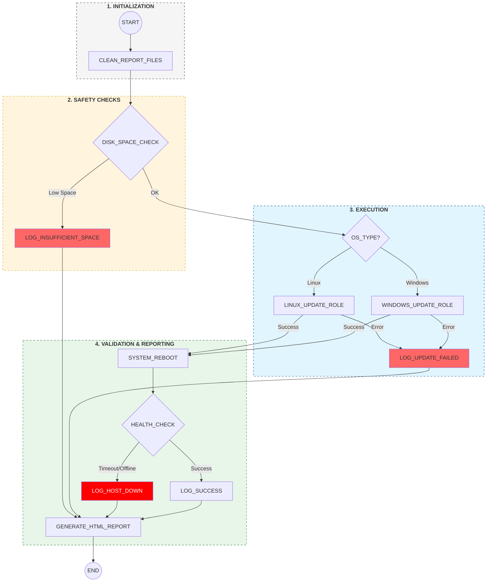

# Run Linux and Windows updates with Ansible

## Requirements
- Ansible 2.9

&nbsp;

## Workflow

The workflow follows a 4-step automated cycle:
- **Initialization:** It first clears old data to ensure the report starts fresh.
- **Safety Checks:** It verifies disk space to prevent system crashes during updates.
- **Execution:** It automatically detects if a server is Linux or Windows, applies patches, and captures any errors during the process.
- **Validation & Reporting:** After a reboot, it confirms the server is back online and generates a visual dashboard showing which systems are OK, FAILED, or UNREACHABLE.

```mermaid
graph TD;
    %% STEP 1: INITIALIZATION
    subgraph STEP_1 [<b>1. INITIALIZATION</b>]
        START((START)) --> CLEAN[CLEAN_REPORT_FILES];
    end

    %% STEP 2: SAFETY CHECKS
    subgraph STEP_2 [<b>2. SAFETY CHECKS</b>]
        CLEAN --> SPACE{DISK_SPACE_CHECK};
        SPACE -- Low Space --> ERR_SPACE[LOG_INSUFFICIENT_SPACE];
    end

    %% STEP 3: EXECUTION
    subgraph STEP_3 [<b>3. EXECUTION</b>]
        SPACE -- OK --> OS_DECISION{OS_TYPE?};
        OS_DECISION -- Linux --> LIN_UPD[LINUX_UPDATE_ROLE];
        OS_DECISION -- Windows --> WIN_UPD[WINDOWS_UPDATE_ROLE];
        
        LIN_UPD -- Error --> ERR_UPD[LOG_UPDATE_FAILED];
        WIN_UPD -- Error --> ERR_UPD;
    end

    %% STEP 4: VALIDATION & REPORTING
    subgraph STEP_4 [<b>4. VALIDATION & REPORTING</b>]
        LIN_UPD -- Success --> REBOOT[SYSTEM_REBOOT];
        WIN_UPD -- Success --> REBOOT;
        
        REBOOT --> VALIDATE{HEALTH_CHECK};
        
        VALIDATE -- Timeout/Offline --> ERR_CRIT[LOG_HOST_DOWN];
        VALIDATE -- Success --> ERR_NONE[LOG_SUCCESS];
        
        ERR_SPACE --> HTML[GENERATE_HTML_REPORT];
        ERR_UPD --> HTML;
        ERR_CRIT --> HTML;
        ERR_NONE --> HTML;
    end

    HTML --> END((END));

    %% Styling
    style STEP_1 fill:#f5f5f5,stroke:#333,stroke-dasharray: 5 5
    style STEP_2 fill:#fff4dd,stroke:#d4a017,stroke-dasharray: 5 5
    style STEP_3 fill:#e1f5fe,stroke:#01579b,stroke-dasharray: 5 5
    style STEP_4 fill:#e8f5e9,stroke:#2e7d32,stroke-dasharray: 5 5
    style ERR_SPACE fill:#f66
    style ERR_UPD fill:#f66
    style ERR_CRIT fill:#ff0000,color:#fff
```

&nbsp;
  
## Setup
1. Complete inventory with your own hosts
2. Configure hosts access with SSH or WINRM (see groups_vars folder)
3. Manage secrets and protect all sensitive data with ansible vault (optional)
4. Run :
```bash
ansible-playbook main.yml -i inventory
```

&nbsp;
  
### Reporting

  
